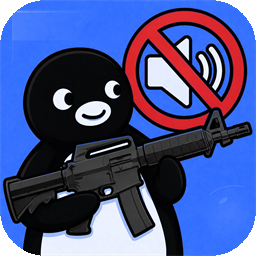

<p align="center">
  
</p>

<h1 align="center">CS2 Focus Guard</h1>

<p align="center">Automatically suppresses Windows notifications and unapproved app audio while Counter-Strike 2 is running, so nothing interrupts your game.</p>

<p align="center"><a href="README.md">繁體中文</a></p>

<p align="center">
  
  
  
</p>

<p align="center">
  <a href="#-features">Features</a> · <a href="#-why-i-made-this">Why I Made This</a> · <a href="#-screenshots">Screenshots</a> · <a href="#-how-it-works">How It Works</a> · <a href="#-installation">Installation</a> · <a href="#-building-from-source">Building from Source</a> · <a href="#-faq">FAQ</a>
</p>

---

> This project is not affiliated with, endorsed by, or partnered with Valve or Counter-Strike 2.

## 🚀 About

CS2 Focus Guard monitors `cs2.exe` and automatically isolates Windows notifications and audio from apps outside your allowlist while you play. When the game ends, the feature is disabled, or the application closes, it safely restores your previous notification and audio states.

## 💭 Why I Made This

> I got tired of my roommate constantly going, “ding ding ding, ding ding ding” - 蛋堡

I usually keep Telegram open in the background, but a notification can suddenly blare at full volume while I am shift-walking in CS2 to stay silent and avoid giving away my position. Those moments require complete focus, so desktop notifications are extremely disruptive.

## ✨ Features

- Detects whether `cs2.exe` is running and checks once per second.
- When enabled, switches the Windows notification mode when the game starts:
  - Windows 11 uses "Priority only".
  - Windows 10 uses "Alarms only".
- Includes an audio allowlist: `cs2.exe` is always allowed, while Discord, Oopz, and KOOK are allowed by default.
- Lets you toggle additional allowlisted applications from the app list. Allowed applications are shown first.
- Mutes apps outside the allowlist and Windows system sounds during a game, including newly created audio sessions.
- Restores the previous notification setting and every audio mute state changed by the app when the game ends, the feature is disabled, or the application closes.
- Preserves any notification mode you select manually while the game is running.
- Temporarily allows an app for the current game if you manually unmute it.
- Saves notification and audio recovery state so it can attempt to restore them when restarted after an unexpected exit.
- Supports the system tray, a single application instance, minimizing to the system tray when closed, and starting with Windows.
- Includes Traditional Chinese and English user interfaces.

## 📷 Screenshots

Screenshots are coming soon.

## 🔧 How It Works

The application checks whether `cs2.exe` is running once per second.

**When the game starts:**

1. Saves the current Windows notification setting.
2. Switches to "Priority only" on Windows 11 or "Alarms only" on Windows 10.
3. Enumerates every active output device and audio session, keeps CS2 and allowlisted apps audible, and mutes all other apps and system sounds.
4. Watches new audio sessions and output-device changes, then continues applying the allowlist rule.
5. Saves notification and audio recovery state locally so it can attempt to restore them after an unexpected exit.

**When the game ends, the feature is disabled, or the application closes:**

1. Restores the notification setting from before the game if the application still controls it.
2. Restores the original mute state of audio sessions muted by the application.
3. Clears the saved recovery state.

If you change the notification mode manually while playing, the application preserves your choice and does not overwrite it. If you manually unmute an app outside the allowlist, it remains temporarily allowed for the rest of the current CS2 session.

## 📥 Installation

### System Requirements

- Windows 10 22H2 (build 19045) or later
- 64-bit Windows

### Installation Steps

1. Download and run [CS2FocusGuard-Setup-1.0.1-x64.exe](artifacts/CS2FocusGuard-Setup-1.0.1-x64.exe).
2. Complete the installer, optionally creating a desktop shortcut and starting the application with Windows.
3. Start CS2 Focus Guard and enable protection.
4. Launch Counter-Strike 2. The application automatically applies notification and audio allowlist protection.

Application settings, notification recovery state, and audio recovery state are stored only in:

```text
%LocalAppData%\CS2FocusGuard
```

## 🛠 Building from Source

### Requirements

- Windows 10 22H2 (build 19045) or later
- 64-bit Windows
- [.NET 8 SDK](https://dotnet.microsoft.com/download/dotnet/8.0)

Run the following from the project root:

```powershell
dotnet restore .\CS2FocusGuard.sln
dotnet build .\CS2FocusGuard.sln -c Release
```

Run the application:

```powershell
dotnet run --project .\src\CS2FocusGuard.App\CS2FocusGuard.App.csproj
```

Run the tests:

```powershell
dotnet test .\CS2FocusGuard.sln -c Release
```

## ❓ FAQ

### Does this application modify CS2 files or memory?

No. The application only monitors whether `cs2.exe` is running and controls Windows notifications and audio sessions. It does not modify game files, access game memory, or inject code.

### What happens if I change the notification mode manually while playing?

The application preserves your manual choice and does not overwrite it after the game ends.

### How does the audio allowlist work?

CS2 is always allowed. Discord, Oopz, and KOOK are on the allowlist by default, and you can toggle other apps from the application list. Apps outside the allowlist and Windows system sounds are muted while the game runs.

### How are allowlisted applications identified?

The application obtains a PID from the Windows audio session, then matches its executable name. For example, `Discord.exe` is identified as `discord`. Changing a shortcut or display name does not affect matching, but renaming the `.exe` requires adding its new name to the allowlist.

### Will my notification setting be restored after an unexpected exit?

The application saves recovery state before it applies notification suppression and audio muting, then attempts to restore your previous notification and audio states when it next starts.

### Where are application settings stored?

All settings, notification recovery state, and audio recovery state are stored in `%LocalAppData%\CS2FocusGuard`.

### Which Windows versions are supported?

64-bit Windows 10 22H2 (build 19045) or later is supported.

## 📄 Third-Party Notices

For interoperability definitions and installer translation sources used by this project, see [THIRD-PARTY-NOTICES.txt](THIRD-PARTY-NOTICES.txt).

## 📜 License

This project is licensed under the [MIT License](LICENSE). You may use, modify, distribute, and use it commercially, provided that you retain the license and copyright notices.
